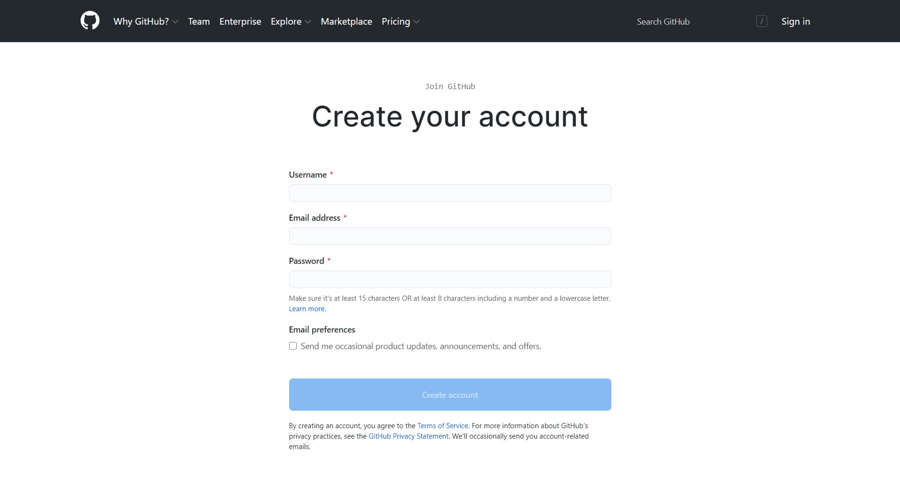
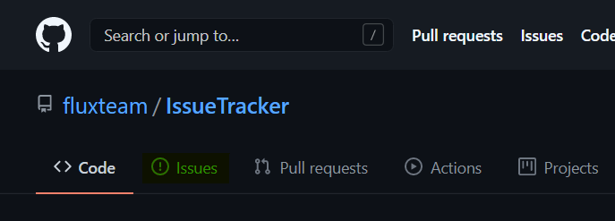

# Issue Tracker
Report issues, give feedback and request features about any Flux service.

### Creating a new issue

* If you don't have a GitHub account yet, <a href="https://github.com/join" target="_blank">create new one.</a>  
  

* After creating your account, go to the "Issues" tab.  
  

* Click "New Issue" button.  
  

* Choose what type of Issue you want to create.  
  

* Fill the Issue, and create!  
  
