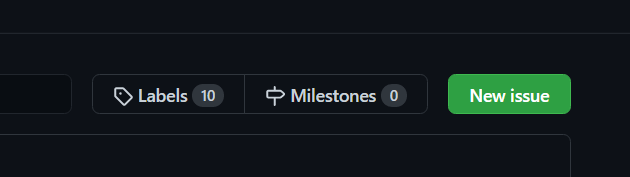
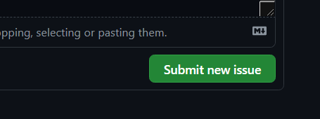

# Issue Tracker
Report issues, give feedback and request features about any Flux service.

> Read the document in your language: 
> `English (EN)` [`Türkçe (TR)`](https://github.com/fluxteam/IssueTracker/blob/main/README_TR.md)

## Creating a new issue

* If you don't have a GitHub account yet, <a href="https://github.com/join" target="_blank">create new one.</a>  
  

* After creating your account, go to the "Issues" tab.  
  

* Click "New Issue" button.  
  

* Choose what type of Issue you want to create.  
  

* Fill the Issue, and create!  
  
  
## What happens after creating an issue?

We (FluxTeam) will take a look into to your issue, and you will able to what is going on by going to the issue that you created. We can add labels, assign people and do other actions to your issues when needed. As we are humans and have our own lives, we can't give an exact date when your issue will get attention.

If your problem does not comply with the rules, it can be ignored or closed without any notice. 
